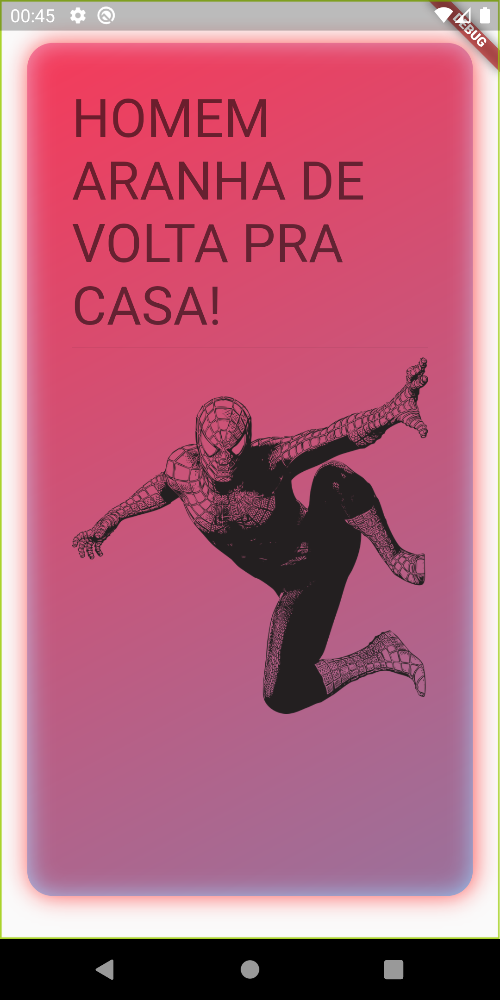

# Card
 
  
### O que é um card?

É um Widget do material designer, que contém informaçõoes relacionadas e pode ser composto de qualquer widget, geralmente usado com ListTile;

O cartão é o único filho, mas seu filho pode ser coluna, linha, lista e grade de Widgets;

No flutter os cards possuem cantos arredondados, dando um efeito-3D;
E seu sombreado pode ser alterado. 

